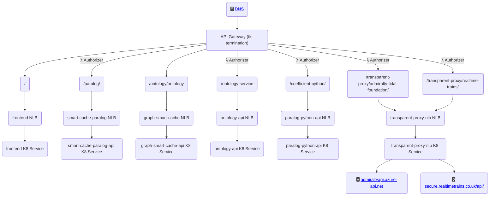

# Deployment notes

## Architecture

## CI
This project has the following CI workflows:
1. Pre-commit - [link](https://github.com/CoefficientSystems/c477-paralog/blob/develop/.github/workflows/pre-commit.yml)
2. Frontend - [link](https://github.com/CoefficientSystems/c477-paralog/blob/develop/.github/workflows/frontend-ci.yml)
3. Backend - [link](https://github.com/CoefficientSystems/c477-paralog/blob/develop/.github/workflows/backend-ci.yml)
4. Dependabot - [link](https://github.com/CoefficientSystems/c477-paralog/blob/develop/.github/dependabot.yml)

## CD
This project has the following CD:
1. [cd-template.yml](https://github.com/CoefficientSystems/c477-paralog/blob/develop/.github/workflows/cd-template.yml): Base template for creating environments.
   2. [cd-prod.yml](https://github.com/CoefficientSystems/c477-paralog/blob/develop/.github/workflows/cd-prod.yml): CD for production (uses cd-template.yml)
   2. [cd-staging.yml](https://github.com/CoefficientSystems/c477-paralog/blob/develop/.github/workflows/cd-staging.yml): CD for staging (uses cd-template.yml)

## Staged development
We needed to split this into two stages because OpenTofu tries to create resources before
the cluster and nodes are entirely created. This part sets up the stage so we can
install applications in the next stage.
### Stage 1
Installs the Setup for the  VPC, IGW, Subnets, Nat, and Routes. Installs and configures EKS
cluster and nodes.

### Stage 2
Assumes that EKS cluster and nodes are available. Sets up everything else like helm
packages for AWS Load Balancer Controller, API GW and its networking, Database and its
connectivity, and all the services needed for Paralog to run. Namely:

| N | *Service*               | *Internal Ports* | *Endpoint*           | *Auth* | *Summary*                                                                              |
|---|-------------------------|------------------|----------------------|--------|----------------------------------------------------------------------------------------|
| 1 | frontend                | 80:80            | /                    |  No    | Primary React application with the Paralog frontend                                    |
| 2 | smart-cache-paralog-api | 4001:4001        | /paralog/            |  Yes   | Paralog API to Telicent Core knowledge graph                                           |
| 3 | graph-smart-cache       | 3030:3030        | /ontology/ontology   |  No    | Telicent Core linked data core service                                                 |
| 4 | ontology-api            | 5007:80          | /ontology-service/   |  Yes   | Paralog API to Telicent Core ontology graph                                            |
| 5 | paralog-python-api      | 8000:8000        | /coefficient-python/ |  Yes   | Coefficient backend services outwith the security perimeter                            |
| 6 | transparent-proxy       | 5013:80          | /transparent-proxy/  |  Yes   | Coefficient proxy service for third party integrations avoiding cross-origin requests  |

### Manual setup
The following setups are not part of the CI/CD
1. DSN, SSL certificate, and API GW endpoints.
2. Adding "IAM access entries" for users to enable debugging of EKS
3. Increasing the Lambda concurrency limit from 10 to 1000.

### Detailed notes on SSL setup for the project.
Stages 1 and 2 will create API GW for the environment. This API will have all the required Routes, Authorizations,
Integrations and VPC links are needed for the project. To expose this on a domain we manage, we will need to do the
following steps:
1. Create SSL certificates using AWS Certificate Manager (ACM).
2. Create API GW Custom domain names and configure API Mappings.
3. Add the developer's AWS account access to EKS -> Access -> IAM access entries. This enables developers to debug.

**Note**: For detailed notes on Environment setup please refer to [ENV_SETUP.md](ENV_SETUP.md)

# Further improvements
1. LB Consolidation.
2. Wait for LB provisioning.
3. EKS Pod Identity to enable RDS access.
4. Automation of manual steps described above.
5. Adding cloudwatch logs to services.
6. Review of IAM roles.
7. Increase replica counts for services.
