# VISTA Documentation

- [Introduction](#introduction)
- [System Architecture](#system-architecture)
  - [Entry Point and Authentication](#entry-point-and-authentication)
  - [User Interface](#user-interface)
  - [The APIs](#the-apis)
  - [Data Storage Layer](#data-storage-layer)
  - [External Connections and Security](#external-connections-and-security)
  - [VISTA Technology Stack and Data Sources](#vista-technology-stack-and-data-sources)
- [VISTA Asset Scores](#vista-asset-scores)
  - [Scoring Framework Overview](#scoring-framework-overview)
  - [Scoring Dimensions](#scoring-dimensions)
    - [1. Criticality Score (C)](#1-criticality-score-c)
    - [2. Dependency Score (D)](#2-dependency-score-d)
    - [3. Exposure score (E)](#3-exposure-score-e)
    - [4. Redundancy Score (R)](#4-redundancy-score-r)
- [VISTA Features](#vista-features)
  - [Road Blocks](#road-blocks)
  - [Route Planner](#route-planner)
    - [The Underlying A-Star (A\*) Algorithm](#the-underlying-a-star-a-algorithm)
  - [Sandbags](#sandbags)
    - [Designated Locations and Initial Stock](#designated-locations-and-initial-stock)
- [Data Room](#data-room)
- [Future Development](#future-development)
  - [Asset Failure Simulation](#asset-failure-simulation)
  - [AI Report Management](#ai-report-management)
    - [The Incident Response Form](#the-incident-response-form)
  - [AI Summary (Automated SITREP)](#ai-summary-automated-sitrep)
  - [AI Search (Live Logs)](#ai-search-live-logs)
  - [Previous Reports (Section 19) AI Search](#previous-reports-section-19-ai-search)
- [Getting Involved](#getting-involved)
  - [Code and Resources](#code-and-resources)

# Introduction

VISTA is an advanced digital mapping platform built to evaluate, visualize, and model cascading infrastructure failures during crisis situations. It offers real-time tracking of system dependencies, clearly demonstrating how the failure of critical assets—like transportation networks, substations, and hospitals—cascade outward to impact dependent services and local population.

Leveraging real-world VISTA offers emergency scenario modeling. This enables proactive planning, helping emergency responders, infrastructure managers, and policymakers anticipate failure pathways and optimise their response strategies before an incident occurs.

# System Architecture

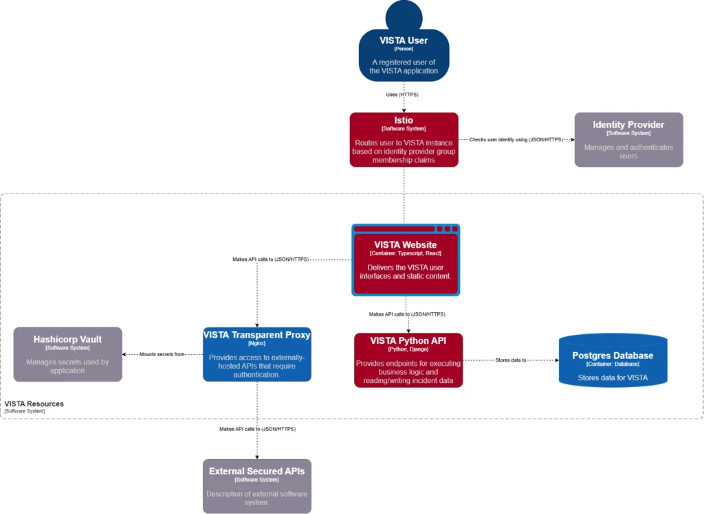

The flow of user interaction and data within VISTA application architecture is as follows:

## Entry Point and Authentication

- **User:** The process begins with a registered user accessing the application over a secure HTTPS connection.
- **Routing:** The user's request first comes to Istio which a service mesh that acts as the entry point. Istio is responsible for routing the user to the correct VISTA instance.
- **Identity Provider:** Before granting access, Istio communicates with an external Identity Provider via JSON/HTTPS to authenticate the user and verify their identity.

## User Interface

- **VISTA Website (Frontend):** Once authenticated, Istio routes the user to the VISTA Website. This frontend component is built using TypeScript and React. It is responsible for delivering the user interface and content directly to the user's browser.

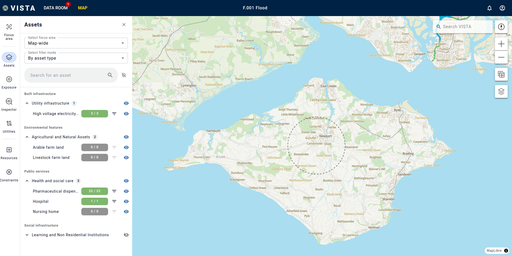

## The APIs

The VISTA Website does not process data directly; instead, it makes JSON/HTTPS calls to two distinct backend services depending on the user's actions:

- **VISTA Transparent Proxy (Nginx):** This proxy handles requests that require access to external, securely hosted APIs (such as real-time train data).
- **VISTA Python API (Python/Django):** This is one of the main backend engines. It provides endpoints for executing core business logic, particularly for reading and writing incident data.

## Data Storage Layer

The APIs interacts with a PostgreSQL database container to store standard relational data for the VISTA application.

## External Connections and Security

- **External Secured APIs:** The Transparent Proxy routes traffic out of the VISTA environment to external third-party APIs as needed.
- **Hashicorp Vault:** Security is centralized using Hashicorp Vault. It manages and securely injects ("mounts") secrets, passwords, and API keys directly into the VISTA Python API. This ensures that sensitive credentials are not hardcoded into the application code.

## VISTA Technology Stack and Data Sources

|                               |                                                                                                                                                       |                                                                                                                                                                              |
|:------------------------------|:------------------------------------------------------------------------------------------------------------------------------------------------------|:-----------------------------------------------------------------------------------------------------------------------------------------------------------------------------|
| **Architectural Layer**       | **Technologies & Tools**                                                                                                                              | **Primary Function**                                                                                                                                                         |
| **Frontend / User Interface** | React, Vite, Tailwind CSS, TypeScript                                                                                                                 | Delivers the interactive web application to the user. Vite provides fast build tooling.                                                                                      |
| **Routing & Security**        | Istio, Identity Provider, Hashicorp Vault                                                                                                             | Istio handles secure traffic routing and group-based access. The ID Provider authenticates users, and Vault securely injects passwords/keys into the backend.                |
| **Backend APIs & Proxy**      | Python (Django), TypeScript (Express), Nginx                                                                                                          | Django runs the core business logic and database interactions. Nginx proxies external real-time data.                                                                        |
| **Geospatial Engine**         | MapLibre, GeoPandas, Shapely, NetworkX                                                                                                                | MapLibre renders interactive maps on the frontend. GeoPandas and Shapely process complex spatial geometries, while NetworkX is for asset dependency models and road routing. |
| **Databases & Storage**       | PostgreSQL                                                                                                                                            | Postgres stores standard relational application data.                                                                                                                        |
| **Core Data Sources**         | CQC API, National Public Transport Access Node (NaPTAN), Network route maps, NHS Open Data Portal, OS Names and OS National Geographic Database (NGD) | Data sources for VISTA from Care Quality Commission, Department for Transport, National Grid, NHS and Ordnance Survey respectively.                                          |

# VISTA Asset Scores

VISTA is currently focused on the Isle of Wight with a total of 14,125 assets from across all the data sources divided into categories and subcategories.

|                             |                                                                            |
|:----------------------------|:---------------------------------------------------------------------------|
| **Vista Asset Category**    | **Subcategories**                                                          |
| **Built infrastructure**    | Energy, Emergency services, Food, Health, Shelter, Transport, Waste, Water |
| **Economic & financial**    | Businesses   Local economy                                             |
| **Natural & environmental** | Agriculture   Biodiversity                                             |
| **Social & community**      | Community, Education, Vulnerable populations                               |

The VISTA asset scoring framework is designed to provide a transparent, measurable, and visual ranking of infrastructure assets. It provides clarity by breaking down asset importance into individually measurable dimensions.

The scoring model is built to answer four critical questions during an emergency:

1. How important is this asset?
2. How many other assets or services depend on it?
3. What happens if it fails?
4. What happens if the performance of the asset is degraded?

To ensure alignment with UK public sector and infrastructure standards, the dimensions map directly to existing resilience terminology and frameworks, including Defra SEMD, the National Risk Register (NRR), Environment Agency (EA) flood maps, Met Office hazard managers, the Civil Contingencies Act, and standard Business Continuity Management practices.

## Scoring Framework Overview

Each asset is evaluated across four core dimensions: **Criticality (C)**, **Dependency (D)**, **Exposure (E)**, and **Redundancy (R)**.

Each dimension is scored on an ordinal scale of **0 to 3** (0 = Negligible, 1 = Low, 2 = Medium, 3 = High). These scores are aggregated to provide a maximum total score of 12, enabling clear categorisation while maintaining enough variation for operational planning:

- **0 - 3:** Low Significance
- **4 - 6:** Medium Significance
- **7 - 9:** High Significance
- **10 - 12:** Critical Significance

---

## Scoring Dimensions

### 1. Criticality Score (C)

**Objective:** Determines how vital the asset is to public safety, essential services, or national/local functioning. The criticality score is preassigned for each asset base information from the [national risk register](https://assets.publishing.service.gov.uk/media/67b5f85732b2aab18314bbe4/National_Risk_Register_2025.pdf) and expert knowledge.

|           |                                           |                                                                                                          |
|:----------|:------------------------------------------|:---------------------------------------------------------------------------------------------------------|
| **Score** | **Definition**                            | **Examples**                                                                                             |
| **0**     | Not essential                             | Small shop, public park, local footpath                                                                  |
| **1**     | Useful, but not safety-critical           | Petrol station, minor road                                                                               |
| **2**     | Important public function                 | GP surgery, secondary school, water pumping station                                                      |
| **3**     | Life-critical or essential infrastructure | Hospital A&E, high-voltage substation feeding a hospital, major transport interchange (e.g., ferry port) |

### 2. Dependency Score (D)

**Objective:** Measure how many other (critical) assets or services depend on this node to function. The dependency score of a provider (successor) asset is the average criticality score of all its dependent assets. For example if Substation 1 powers a Hospital with criticality score 3, Care Home with criticality score 2 and Retail Park with criticality score 1, the dependency score of the substation = (3+2+1)/3 = 2.

|           |                                                  |                                                                                                                         |
|:----------|:-------------------------------------------------|:------------------------------------------------------------------------------------------------------------------------|
| **Score** | **Definition**                                   | **Examples**                                                                                                            |
| **0**     | No dependencies                                  | Rural bus stop, allotment shed                                                                                          |
| **1**     | One or two low-critical assets depend on it      | Rural substation powering homes, minor access road to a GP                                                              |
| **2**     | Several medium/high-critical assets depend on it | Substation for NHS sites, road connecting a town to an emergency evacuation route                                       |
| **3**     | Central node with critical dependencies          | Single access bridge to an island, energy hub powering a hospital, emergency services depot, wastewater treatment plant |

### 3. Exposure score (E)

**Objective:** Assess the degree to which the asset is exposed to known environmental or operational risks.

An asset will have an exposure score of 3 if the asset intersects with two or more exposure layers e.g the asset is inside a flood plain and a heatwave zone. The exposure score will be 2 if an asset is inside one exposure layer e.g. flood plain, a 1 if it is <= 500m from the layer and a 0, if it is > 500m away from an exposure layer.

|           |                                   |                                                                            |
|:----------|:----------------------------------|:---------------------------------------------------------------------------|
| **Score** | **Definition**                    | **Examples**                                                               |
| **0**     | No known exposure                 | High ground (for flood risk), low crime area, not reliant on single comms. |
| **1**     | Some exposure                     | Surface water zone, small cyber exposure, minor landslide risk             |
| **2**     | High exposure to a single threat  | Floodplain, heat stress zone, cyber-dependent on legacy systems            |
| **3**     | Multiple overlapping risk factors | Flood risk + telecoms bottleneck + energy dependency                       |

### 4. Redundancy Score (R)

**Objective:** Evaluates how easily the asset’s function can be replaced or re-routed if it fails.

Redundancy score is calculated using the distance of an asset to its backup asset. Dependency score of 3​ means no back up​, score of 2​ means backup > 5km​ away, score of 1​ implies asset is 2km – 5km from backup​ and score of 0​ means asset is < 2km from backup​.

|           |                                     |                                                                                                    |
|:----------|:------------------------------------|:---------------------------------------------------------------------------------------------------|
| **Score** | **Definition**                      | **Examples**                                                                                       |
| **0**     | Multiple backups or low consequence | Hospital with nearby alternatives, telecoms with fibre loops                                       |
| **1**     | Some redundancy or alternate routes | Bypass roads exist, emergency generators on-site                                                   |
| **2**     | Limited redundancy                  | Single road access but a temporary route can be created, backup exists but is not always available |
| **3**     | No practical redundancy             | Sole power feed, one-lane bridge, no alternative available for weeks if disrupted                  |

# VISTA Features

VISTA is equipped with features that enable planners and emergency responders efficiently deal with different kinds of emergency scenarios.

## Road Blocks

When a hazard occurs (such as a severe flood or landslide), users can manually draw physical constraints directly onto map interface. The system processes these constraints as geometric shapes and translates them into mathematical barriers. There are two main types of road blocks:

- **Polygon Blocks (Area Hazards):** Used for large-scale, hazards like flood plains, heatwave or chemical spill evacuation zones. The user draws a multi-point shape on the map. The backend uses the `Shapely` Python library to convert these coordinates into a geometric `Polygon`. The system then checks every road segment (edge) in the network; if any part of a road segment intersects this polygon, that road is completely removed from the routing graph.
- **Line Segment Blocks (Linear Hazards):** Used for specific, localised closures during emergencies, such as a multi-car collision or a downed power line. The user draws a line directly over the affected road. To ensure absolute precision, the system creates a small spatial buffer (approximately 15 meters) around this line to create a micro-polygon. Any road intersecting this buffer is removed from the routing network.

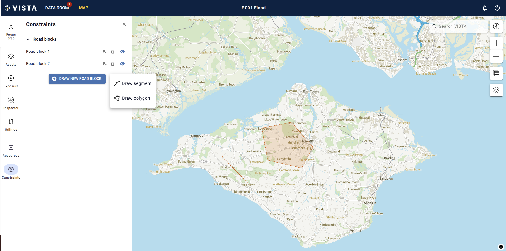

## Route Planner

VISTA is equipped with intelligent Route planner for cars, HGVs and Emergency vehicles. A user can draw start (Green ‘S') and end (Red 'E’) points on the map and the system automatically finds best routes in milliseconds.

### The Underlying A-Star (A\*) Algorithm

At the backend the route planner system uses the A-Star (A) pathfinding algorithm, and is designed to intelligently avoid roadblocks in the following ways:

1. **Graph Copying:** The system maintains a master directed graph `G` of all roads on the Isle of Wight. When a route request is made, it creates a temporary copy of this graph `H`.
2. **Edge Deletion:** All intersecting roadblocks and vehicle-specific constraints (like low bridges) are processed, and their corresponding edges are deleted from graph `H`. This ensures the algorithm does not traverse a blocked path.
3. **Heuristic Search (Haversine):** A-Star is faster than standard Dijkstra because it uses the Haversine formula as its heuristic function. The Haversine formula calculates the straight-line (great-circle) distance across the curvature of the earth between the algorithm's current node and the final destination.
4. **Path Calculation:** As A-Star explores graph `H`, it calculates the cost of moving to the next node based on the road's length (`weight`), plus the Haversine heuristic estimating the remaining distance. It continuously prioritises exploring roads that bring the vehicle closer to the destination, seamlessly routing around the user-drawn roadblocks.

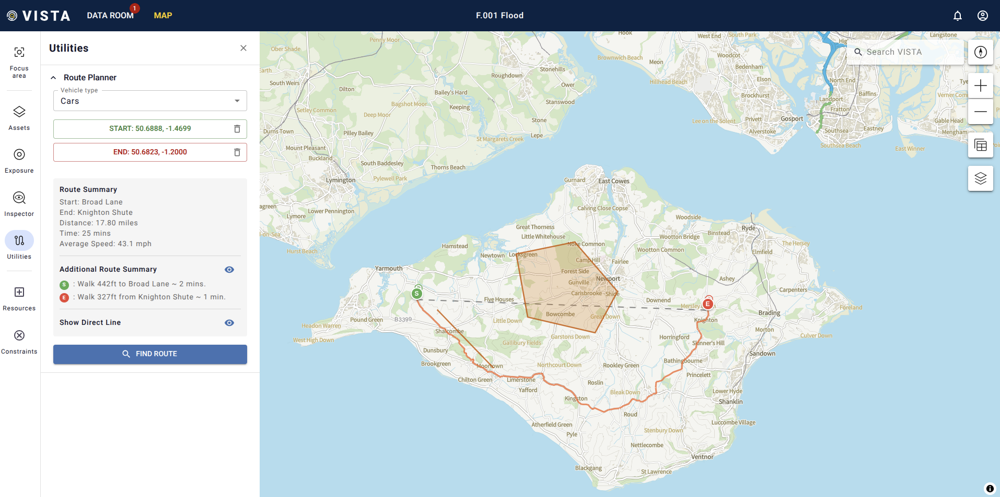

## Sandbags

The Sandbags feature is a dedicated logistical and resource management tool designed to track physical flood-defense inventory across an operational area in real time. It ensures that incident commanders and members of the local resilience forum have accurate, up-to-date visibility of critical resources during a flood.

### Designated Locations and Initial Stock

The system is pre-configured with a network of strategic stockpiles across the Isle of Wight. Each stockpile is initialised with a default baseline capacity of 300 sandbags. The locations are:

- Well Road, East Cowes
- Simeon Street Rec, Ryde
- St Mary’s car park, Cowes
- River Road, Yarmouth
- Moa Place, Freshwater
- Marsh Road, Gurnard
- Lugley Street, Newport

The Sandbag icons are colour-coded to provide instant situational awareness regarding stock levels:

- **Green:** Healthy stock levels (greater than or equal to 50% capacity).
- **Amber:** Warning stock levels (between 20% and 50% capacity).
- **Red:** Critical stock levels (less than 20% capacity).

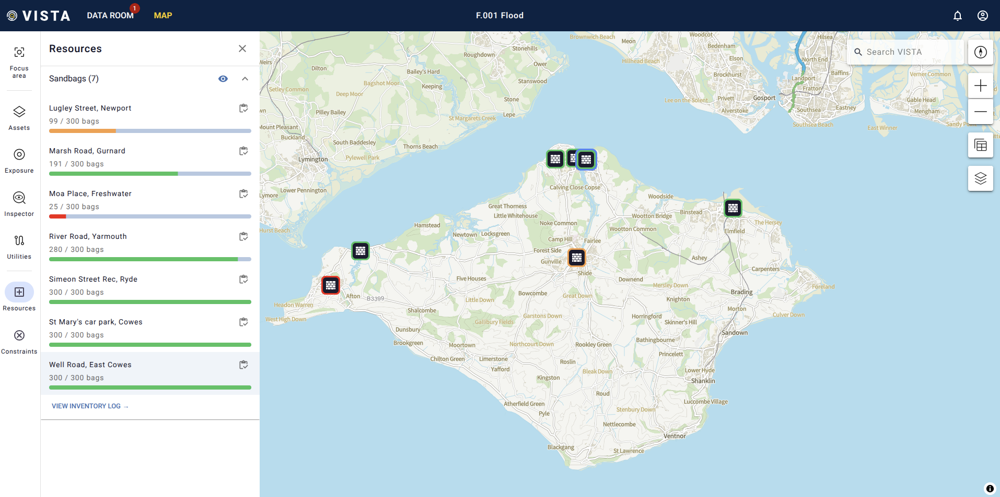

Sandbags can be withdrawn or restocked and there is an inventory log of activities performed by users for audit purposes.

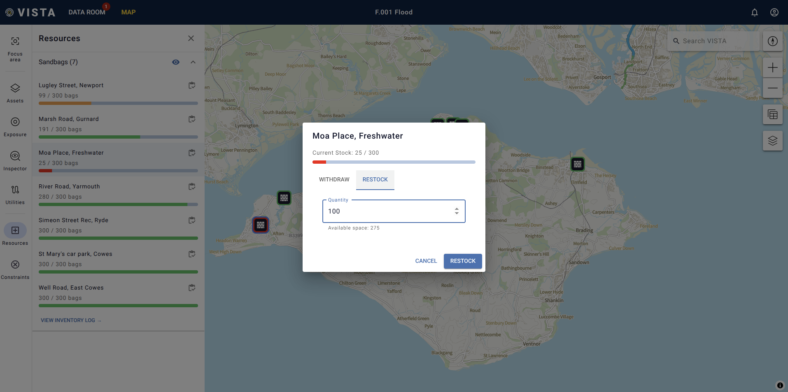

# Data Room

The VISTA Data Room is a dedicated data management interface designed to provide administrators with complete oversight and control of data sources and access management. Admins can also manage various scenarios such as flood or wildfire. Admins can also control the data a logged in user can see using Role-Based Access Control (RBAC).

The system currently houses a total of 14,125 individual asset features sourced from various national authorities. The active datasets in VISTA include:

- **CQC API:**

  - **Data Owner:** Care Quality Commission.
  - **Rows:** 0.
- **National Public Transport Access Node (NaPTAN):**

  - **Data Owner:** Department for Transport.
  - **Rows:** 758.
- **Network route maps:**

  - **Data Owner:** National Grid.
  - **Rows:** 3.
- **NHS Open Data Portal:**

  - **Data Owner:** NHS.
  - **Rows:** 22.
- **OS Names:**

  - **Data Owner:** Ordnance Survey.
  - **Rows:** 45.
- **OS National Geographic Database (NGD):**

  - **Data Owner:** Ordnance Survey.
  - **Rows:** 13,297.

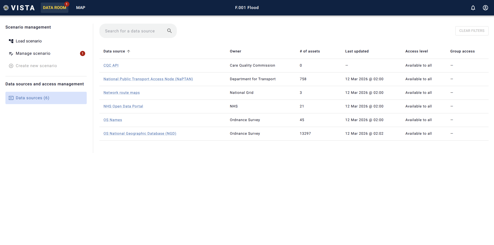

# Future Development

VISTA has gone through various development life cycles mainly:

- Proof of Concept
- Development
- Staging
- Production

The current production release has been open-sourced. Fully developed features coming in future releases of VISTA from the Proof of Concept (PoC) development include:

## Asset Failure Simulation

The asset failure simulation feature is designed to model how the failure of a critical asset (e.g., a flooded substation) triggers cascading failures of dependent assets across the infrastructure network. When a user selects an assets and clicks on *simulate failure*, the system evaluate the connection strength between the provider asset and the dependent assets in the directed network graph. Failure is propagated if the edge strength is greater than impact threshold preset by admin.

- **Deep Propagation:** If the user toggled "Deep Failure Propagation" the system uses a queue-based algorithm to find all dependent assets recursively failing assets until the cascade stops.
- **Result:** The API returns a list of all failed assets, the total number of failed assets and tabulated details of all failed assets.

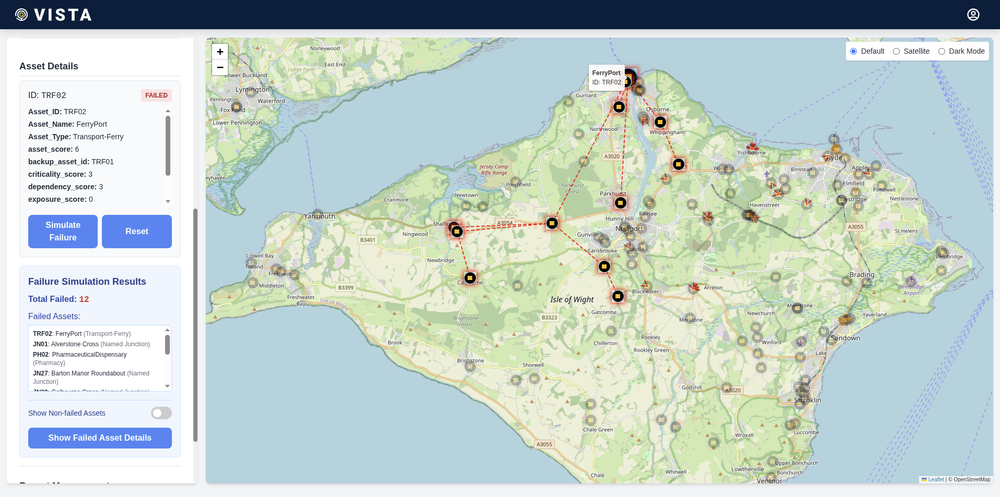

## AI Report Management

VISTA allows members of the local resilience forum to log real-time incident reports using the Joint Emergency Services Interoperability Principles (JESIP) principles.

### The Incident Response Form

This section allows users to report incidents in the structured JESIP format *Situation*, *Response*, and *Forward Look*. The user can also select a RAG Status (Red/Amber/Green) to indicate critical priority level. "Red" indicates immediate threat to life or critical failure, while "Green" means monitored but stable while Amber serves as the critical middle ground between stable and critical.

The reports are submitted to the situation report (SITREP) database where they are viewed and acted upon

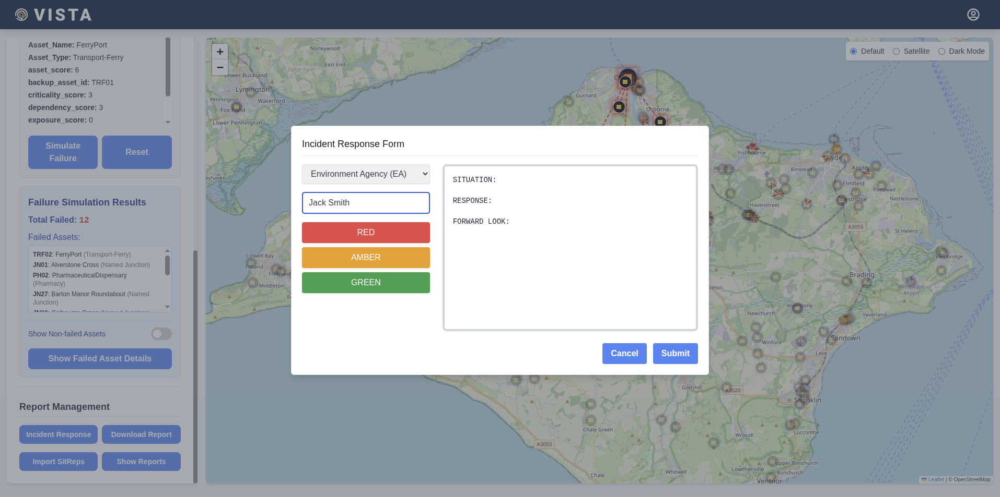

## AI Summary (Automated SITREP)

During a crisis, incident commanders may not have time to read hundreds of individual incident logs. The AI Summary feature automates the creation of a SITREP. When a user clicks on "AI Summary", the logs of all the SITREPs are sent to a local LLM model prompted to generate a report with specific headers Executive Summary, Key Hazards, Agency Actions, and Forward Look.

The prompt specifically instructs the AI to highlight RED and AMBER priority items, ensuring critical and life-safety issues are at the top of the generated report. The one-page summary is concise, generated in under 10 seconds, downloadable, accurate and easily actionable by incident commanders and LRF members which saves precious time during flood or other emergency crisis.

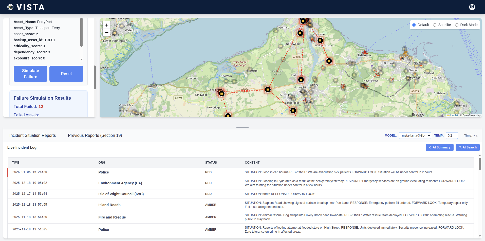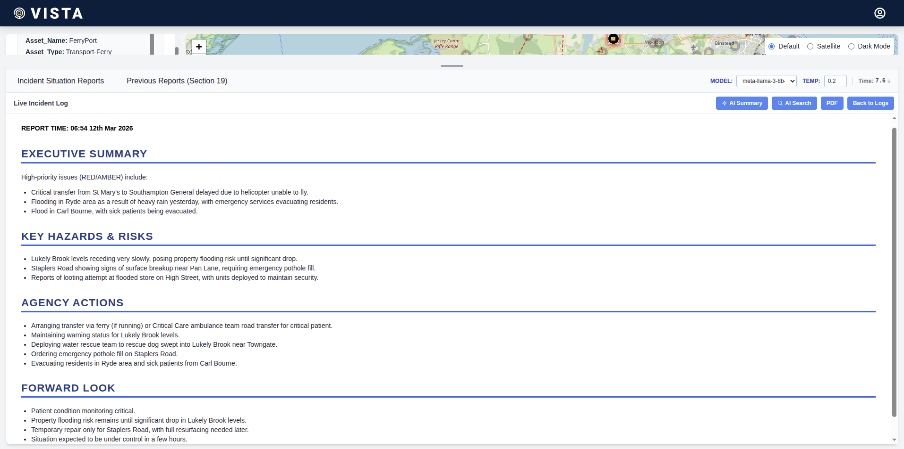

## AI Search (Live Logs)

This feature allows users to chat with their sitrep data using technique called Retrieval-Augmented Generation (RAG). A user could ask *"How many sandbags were deployed in Newport today?"* When a question entered in the text area, the system goes through the RAG pipeline and produces an accurate response based only on the content of all the incident reports. These steps are:

- **1: Embedding:** VISTA uses an embedding model to read every row in the report and converts the text into a long array of numbers representing the meaning of the text.
- **2: Vector Database:** These number arrays are stored in a local vector database called ChromaDB.
- **3: Querying:** When a user asks a question, that question is also turned into numbers. ChromaDB performs a mathematical comparison (cosine similarity) to find the top 10 logs that mathematically align with the user's question.
- **4: Generation:** VISTA takes those specific 10 logs, combines them with the user's question, and sends them to any of the selected LLM models with the instruction to strictly answer the question based on the context. This prevents the AI from hallucinating or making up facts.

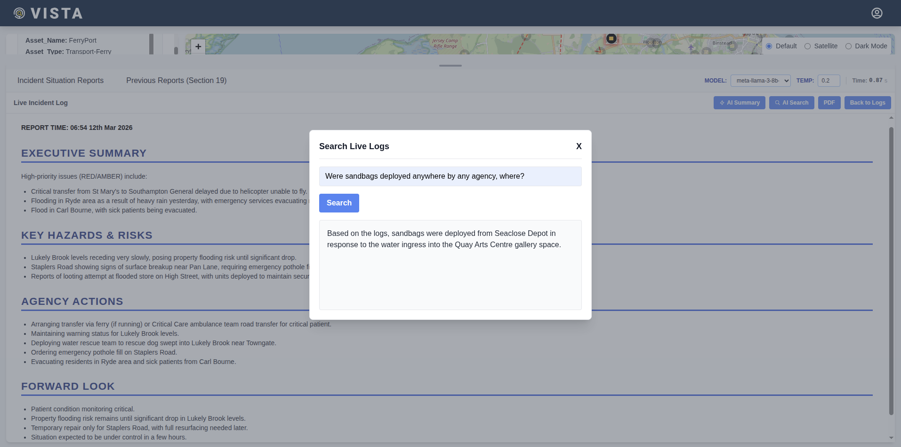

## Previous Reports (Section 19) AI Search

Section 19 reports are massive, historical documents detailing investigations into past floods. VISTA allows operators to use RAG to instantly mine these documents for past mitigations. This is especially a critical and time-saving feature which allows member of the LRF to search through previous reports, get answers to what was done before thereby making faster decisions. Internally it uses Retrieval-Augmented Generation (RAG) pipeline to query the previous reports already stored in a vector database and retrieve concise and accurate answers within seconds.

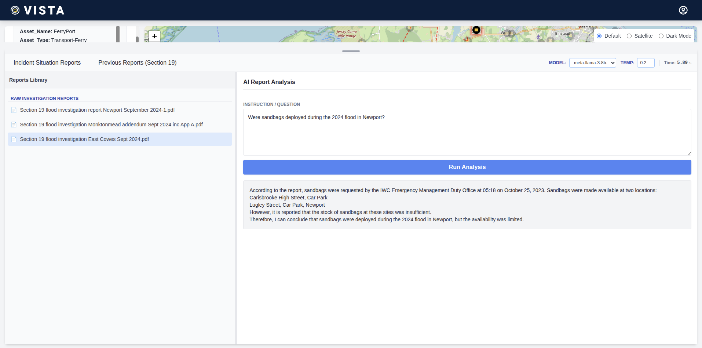

# Getting Involved

Development of VISTA was possible by collaboration with key strategic partners and stakeholders. These are:

- Department for Transport (DfT) - key strategic partner
- Isle of Wight Council - key strategic partner
- Emergency services
- Utility providers
- Island Roads (Highways PFI)
- IoW NHS Trust & Public Health

There are many ways of getting involved

- **Collaboration** – Government bodies, emergency response teams, and healthcare providers can contribute data, expertise, or funding to expand VISTA’s capabilities.
- **Adoption** – Organisations can adopt or adapt VISTA for their own secure data-sharing needs, ensuring the tool is reused and extended for maximum impact.
- **Testing & feedback** – Organisations and individuals can validate use cases, test functionality, and provide feedback to improve usability and effectiveness.
- **Knowledge sharing** – Contributions to best practices, case studies, and policy recommendations are encouraged to guide future expansions.

## Code and Resources

VISTA has been open-sourced and the code is available in this repository. Contact the National Digital Twin Programme at [ndtp@businessandtrade.co.uk](mailto:ndtp@businessandtrade.co.uk)
